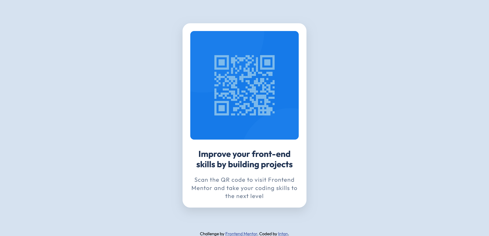

QR Code Component – Frontend Mentor

Solution to the QR Code Component challenge on Frontend Mentor.

Overview

A simple responsive QR code card built with semantic HTML and CSS.
Mobile-first design and fully responsive on desktop.

Screenshot

Mobile

Links

Solution URL:
https://github.com/intan-ayuuu/Frontend-Mentor-QR-Code-Challenge

Live Site URL:
https://intan-ayuuu.github.io/Frontend-Mentor-QR-Code-Challenge/

Built With

HTML5

CSS3

Flexbox

CSS custom properties (variables)

Mobile-first responsive layout

What I Learned

Using width: 100% + max-width for responsive cards

Applying mobile-first media queries with min-width

Proper use of margin vs padding

Improving visual hierarchy and spacing

AI Collaboration

Used ChatGPT for:

Debugging layout issues

Understanding responsive sizing

Improving spacing and structure

Author

Frontend Mentor – @intan
